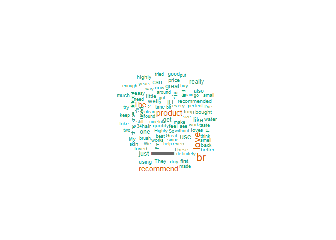
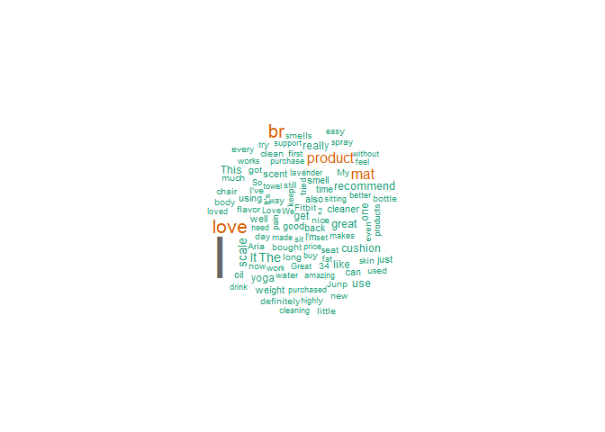

Librerias

    library(readr)
    library(tidyverse)
    library(stringr)
    library(tidytext)
    library(lubridate)
    library(stopwords)
    library(wordcloud)
    library(highcharter)

Cargar datos

    df <- read_csv("Health_and_Personal_Care.csv")

    ## Rows: 494121 Columns: 8
    ## ── Column specification ────────────────────────────────────────────────────────
    ## Delimiter: ","
    ## chr (5): title, text, product_id, parent_id, user_id
    ## dbl (2): rating, timestamp
    ## lgl (1): verified_purchase
    ## 
    ## ℹ Use `spec()` to retrieve the full column specification for this data.
    ## ℹ Specify the column types or set `show_col_types = FALSE` to quiet this message.

    meta <- read_csv("Health_and_Personal_Care_metadata.csv")

    ## Rows: 60293 Columns: 8
    ## ── Column specification ────────────────────────────────────────────────────────
    ## Delimiter: ","
    ## chr (5): main_category, title, store, details, parent_id
    ## dbl (3): average_rating, rating_number, price
    ## 
    ## ℹ Use `spec()` to retrieve the full column specification for this data.
    ## ℹ Specify the column types or set `show_col_types = FALSE` to quiet this message.

    df %>% head()

    ## # A tibble: 6 × 8
    ##   rating title    text  product_id parent_id user_id timestamp verified_purchase
    ##    <dbl> <chr>    <chr> <chr>      <chr>     <chr>       <dbl> <lgl>            
    ## 1      4 12 mg i… "Thi… B07TDSJZMR B07TDSJZ… AFKZEN…   1.58e12 TRUE             
    ## 2      5 Save th… "Lov… B08637FWWF B08637FW… AEVWAM…   1.60e12 TRUE             
    ## 3      5 Fantast… "I h… B07KJVGNN5 B07KJVGN… AHSPLD…   1.56e12 TRUE             
    ## 4      4 It hold… "It'… B007HY7GC2 B092RP73… AEZGPL…   1.66e12 TRUE             
    ## 5      1 Not for… "Did… B08KYJLF5T B08KYJLF… AEQAYV…   1.64e12 TRUE             
    ## 6      5 Every h… "I h… B09GBMG83Z B09GBMG8… AFSKPY…   1.65e12 FALSE

    meta %>% head()

    ## # A tibble: 6 × 8
    ##   main_category title average_rating rating_number price store details parent_id
    ##   <chr>         <chr>          <dbl>         <dbl> <dbl> <chr> <chr>   <chr>    
    ## 1 Health & Per… Sili…            3.9             7  NA   Rzoe… 15 x 3… B07V346G…
    ## 2 Health & Per… iPho…            3.8             2  NA   ZHXIN ZHXIN,… B075W927…
    ## 3 Health & Per… Zig …            3.9             7  NA   <NA>  4.1 x … B01FB26V…
    ## 4 Health & Per… Stin…            4.1             6  21.4 Stin… Sting-… B01IAI29…
    ## 5 Health & Per… Heat…            3.3             8  NA   BiBO… 6.1 x … B08CMN38…
    ## 6 Health & Per… Ball…            4.6            19  NA   Tikt… Bachel… B07YJ5JB…

    # Limpiar el texto, quitar comillas dobles
    df$text <- str_replace_all(df$text, pattern = '\\"', replacement = '')
    df %>% head()

    ## # A tibble: 6 × 8
    ##   rating title    text  product_id parent_id user_id timestamp verified_purchase
    ##    <dbl> <chr>    <chr> <chr>      <chr>     <chr>       <dbl> <lgl>            
    ## 1      4 12 mg i… This… B07TDSJZMR B07TDSJZ… AFKZEN…   1.58e12 TRUE             
    ## 2      5 Save th… Love… B08637FWWF B08637FW… AEVWAM…   1.60e12 TRUE             
    ## 3      5 Fantast… I ha… B07KJVGNN5 B07KJVGN… AHSPLD…   1.56e12 TRUE             
    ## 4      4 It hold… It's… B007HY7GC2 B092RP73… AEZGPL…   1.66e12 TRUE             
    ## 5      1 Not for… Didn… B08KYJLF5T B08KYJLF… AEQAYV…   1.64e12 TRUE             
    ## 6      5 Every h… I ha… B09GBMG83Z B09GBMG8… AFSKPY…   1.65e12 FALSE

1.  Cuántos productos contienen reviews con las palabras “love”,
    “recommend” y “enjoy”?

<!-- -->

    # Definir palabras
    p_words <- c("love", "recommend", "enjoy")

    # expresion regular para detectar las palabras
    p_words_regex <- paste(p_words, collapse = '|')

    # Detectar las palabras en las reviews
    df_filtered <- df %>% 
      mutate(p_flag = str_detect(text, pattern = p_words_regex)) %>%  # reviews que contienen alguna de las palabras
      filter(p_flag == TRUE)  # Filtrar solo las que contienen esas palabras

    # Contar los productos unicos que contienen reviews con las palabras
    productos_con_palabras_positivas <- df_filtered %>% 
      summarise(n = n_distinct(parent_id))

    productos_con_palabras_positivas

    ## # A tibble: 1 × 1
    ##       n
    ##   <int>
    ## 1 22218

1.  De los reviews de la pregunta 1, encuentre el top 5 de las tiendas
    que los venden?

<!-- -->

    # Unir con los metadatos de productos para obtener las tiendas
    df_joined <- df_filtered %>%
      left_join(meta, by = "parent_id")  # Unir usando 'parent_id'

    # top 5 de tiendas
    top_5_tiendas <- df_joined %>%
      filter(!is.na(store)) %>%  # las tiendas no sean NA
      group_by(store) %>% 
      summarise(n_reviews = n()) %>%  # cuantos reviews tiene cada tienda
      arrange(desc(n_reviews)) %>%  # de mayor a menor
      head(5)  # solo primeras 5

    top_5_tiendas

    ## # A tibble: 5 × 2
    ##   store      n_reviews
    ##   <chr>          <int>
    ## 1 ASUTRA           950
    ## 2 JUNP             508
    ## 3 Purple           478
    ## 4 US Organic       453
    ## 5 Fitbit           424

1.  Genere un wordcloud sin stopwords de los reviews de la pregunta 1.

<!-- -->

    # Vector de stopwords
    stop_vec <- c(stopwords(language = "en"), stopwords(language = "es"))

    # Tokenizar las palabras y remover las stopwords
    vec_words <- str_split(df_filtered$text, boundary("word")) %>% unlist() 

    # Filtrar las palabras no deseadas
    no_stopwords <- vec_words %>% 
      as_tibble() %>% 
      filter(!(value %in% stop_vec)) %>%  # Eliminar las stopwords
      filter(value != "") %>%  # Eliminar palabras vacias
      group_by(value) %>% 
      summarise(freq = n())  # Contar la frecuencia de cada palabra

    # Generar el wordcloud
    wordcloud(words = no_stopwords$value, freq = no_stopwords$freq, max.words = 100, colors = brewer.pal(8, "Dark2"))

1.  Generar un wordcloud de los reviews de las 5 tiendas encontradas en
    la pregunta 2. Deberá de incluir todos los reviews de esas 5
    tiendas.

<!-- -->

    # nombre de las 5 tiendas
    tiendas_top_5 <- top_5_tiendas$store

    # Filtrar todos los reviews que correspondan a esas 5 tiendas
    df_top_5_reviews <- df_joined %>%
      filter(store %in% tiendas_top_5)  # Filtrar reviews de tiendas mas populares

    # Tokenizar las palabras y remover stopwords
    vec_words <- str_split(df_top_5_reviews$text, boundary("word")) %>% unlist() 

    # Filtrar las stopwords y contar frecuencia
    no_stopwords <- vec_words %>%
      as_tibble() %>%
      filter(!(value %in% stop_vec)) %>%  # Eliminar stopwords
      filter(value != "") %>%  # Eliminar palabras vacias
      group_by(value) %>%
      summarise(freq = n())  # Contar frecuencia de cada palabra

    # Generar el wordcloud
    wordcloud(words = no_stopwords$value, freq = no_stopwords$freq, max.words = 100, colors = brewer.pal(8, "Dark2"))

1.  Cuáles son las 25 palabras más frecuentes de los reviews?

<!-- -->

    # Tokenizar las palabras de los reviews
    vec_words <- str_split(df$text, boundary("word")) %>% unlist()  

    # Filtrar palabras no deseadas (stopwords) y palabras vacias
    no_stopwords <- vec_words %>%
      as_tibble() %>%
      filter(!(value %in% stop_vec)) %>%  # Eliminar stopwords
      filter(value != "")  # Eliminar palabras vacias

    # Contar la frecuencia de cada palabra
    palabras_frecuentes <- no_stopwords %>%
      group_by(value) %>%
      summarise(freq = n()) %>%
      arrange(desc(freq))  # de mayor a menor

    top_25_palabras <- palabras_frecuentes %>%
      head(25)  # 25 palabras mas frecuentes

    print(top_25_palabras, n = 25)

    ## # A tibble: 25 × 2
    ##    value     freq
    ##    <chr>    <int>
    ##  1 I       590669
    ##  2 br      136733
    ##  3 product 100610
    ##  4 The      94876
    ##  5 It       81423
    ##  6 use      80636
    ##  7 like     76352
    ##  8 great    71485
    ##  9 This     69662
    ## 10 one      64936
    ## 11 good     59671
    ## 12 just     54110
    ## 13 well     53951
    ## 14 get      48564
    ## 15 can      45232
    ## 16 work     43545
    ## 17 really   42369
    ## 18 time     39510
    ## 19 used     38009
    ## 20 works    35039
    ## 21 love     35013
    ## 22 much     32669
    ## 23 They     31206
    ## 24 using    30850
    ## 25 little   30765
